<div align="center">

<picture><source media="(prefers-color-scheme: dark)" srcset="docs/readme/hero-dark.svg"></picture>

<br>


<br><br>

**[Read](#-the-reader)** &nbsp;·&nbsp; **[Characters & Events](#-characters--events)** &nbsp;·&nbsp; **[The three texts](#-the-three-texts)** &nbsp;·&nbsp; **[Themes](#-five-themes)** &nbsp;·&nbsp; **[Sources](#-every-word-sourced)** &nbsp;·&nbsp; **[Run it](#-run-it)**

</div>

<br>

<picture><source media="(prefers-color-scheme: dark)" srcset="docs/readme/showcase-dark.jpg"></picture>

<br>

> **Katha** (कथा) is Sanskrit for *story* — the tellings through which these texts have always travelled.
> Katha puts the **Bhagavad Gita**, the **Ramayana** and the **Mahabharata** in your pocket: every verse in the original
> Sanskrit, in transliteration and in English, with plain-language guides to the people in them, the things that happen,
> and the hard choices at their heart. No account, no ads, no tracking — it all lives on your device.

<p align="center"></p>

## 📖 The reader

A calm, book-like page built for reading on a phone. Scroll and the bar steps out of the way; a thin gold line shows how
far through the chapter you are. When a chapter ends, the next one is a tap away.

<picture><source media="(prefers-color-scheme: dark)" srcset="docs/readme/verses-dark.svg"></picture>

<details>
<summary><b>Try one — tap to open Bhagavad Gita 2.47 the way Katha shows it</b></summary>

<br>

<p>कर्मण्येवाधिकारस्ते मा फलेषु कदाचन।<br>मा कर्मफलहेतुर्भूर्मा ते सङ्गोऽस्त्वकर्मणि॥</p>

<p><i>karmaṇyevādhikāraste mā phaleṣu kadācana<br>mā karmaphalaheturbhūrmā te saṅgo'stvakarmaṇi</i></p>

<p>Thy business is with the action only, never with its fruits; so let not the fruit of action be thy motive, nor be thou to inaction attached.<br><sub>— Annie Besant, 1922</sub></p>

<details>
<summary><b>ⓘ&nbsp; What this means</b></summary>

<br>

Among the most cited verses in the entire Bhagavad Gita. Krishna teaches the principle of nishkama karma — action performed without attachment to its results. The verse does not advocate passivity; it draws a careful line between doing one's work fully and being owned by what that work might produce. This teaching is the philosophical core of karma yoga.

</details>
</details>

<br>

<table>
<tr>
<td align="center" valign="top" width="33%"><picture><source media="(prefers-color-scheme: dark)" srcset="docs/readme/screens/reader-dark.png">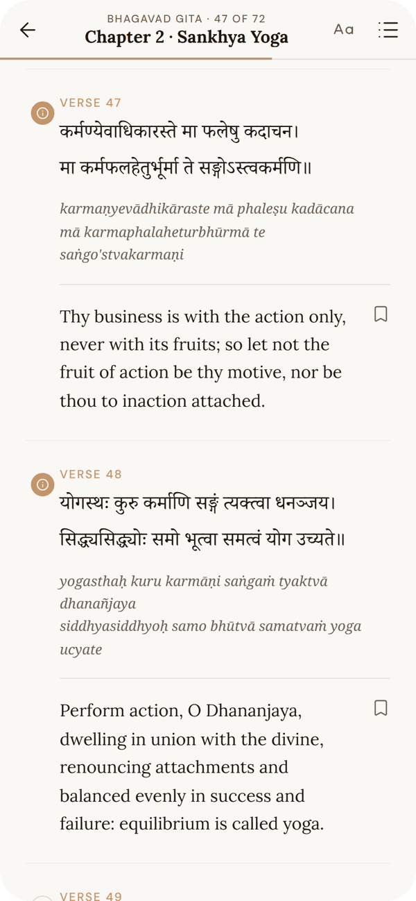</picture><br><b>Read</b><br><sub>Sanskrit, transliteration and English for every verse</sub></td>
<td align="center" valign="top" width="33%"><picture><source media="(prefers-color-scheme: dark)" srcset="docs/readme/screens/explain-dark.png">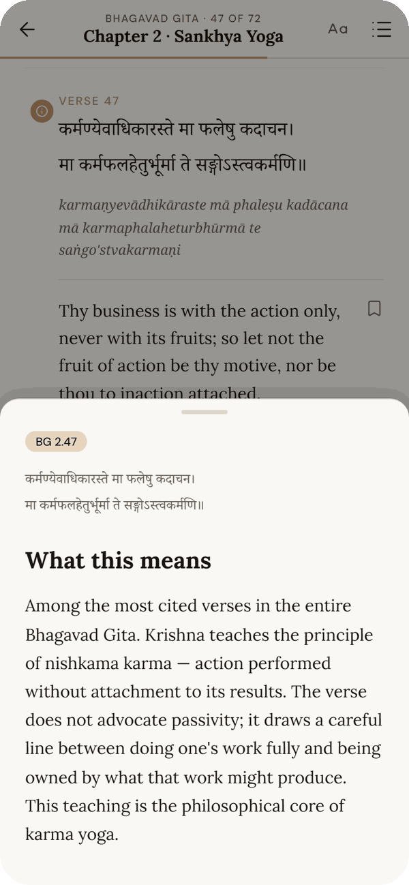</picture><br><b>Understand</b><br><sub>Every Gita verse has an explanation, a tap away</sub></td>
<td align="center" valign="top" width="33%"><picture><source media="(prefers-color-scheme: dark)" srcset="docs/readme/screens/note-dark.png">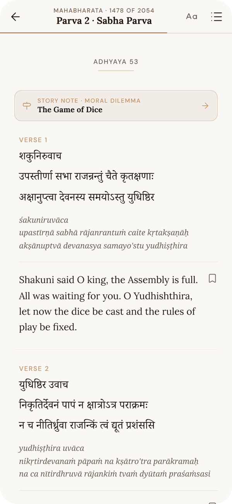</picture><br><b>Story notes</b><br><sub>Where an episode begins, a note links to the full story</sub></td>
</tr>
</table>

- **Continuous scroll**, no pages to flip — just like a book.
- **Jump anywhere**: every Ramayana sarga and Mahabharata adhyaya is one tap from the chapter list.
- **Bookmarks**, cross-text **search** ("valmiki" finds *Vālmīki*), and three reading sizes.

<p align="center"></p>

## 🧭 Characters & Events

Epics are easier to love when you know who everyone is. Katha now carries **54 characters** and a **58-stop timeline of
events** — what happens, *why* it happens, and, for 38 of them, the moral dilemma inside it. 52 events open the reader at the
exact verse where the episode begins.

<table>
<tr>
<td align="center" valign="top" width="33%"><picture><source media="(prefers-color-scheme: dark)" srcset="docs/readme/screens/characters-dark.png">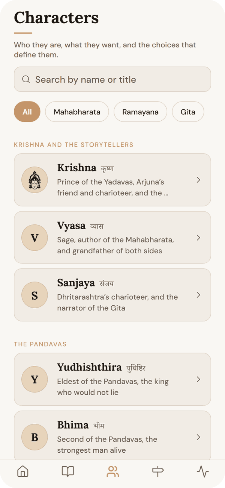</picture><br><b>Characters</b><br><sub>Who's who, grouped by family and kingdom</sub></td>
<td align="center" valign="top" width="33%"><picture><source media="(prefers-color-scheme: dark)" srcset="docs/readme/screens/character-dark.png">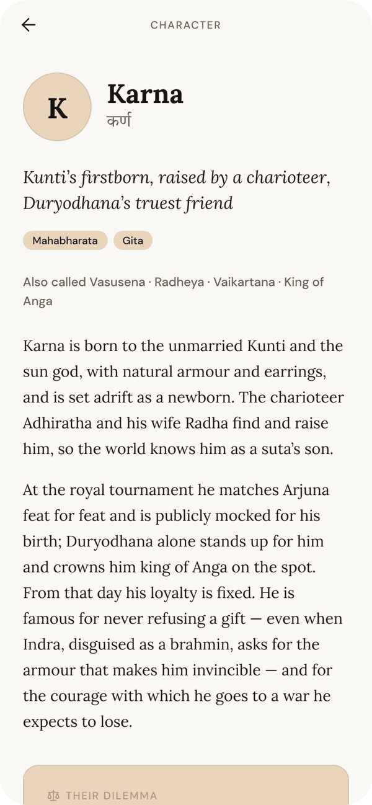</picture><br><b>Their story</b><br><sub>Who they are, what they want, the choice that defines them</sub></td>
<td align="center" valign="top" width="33%"><picture><source media="(prefers-color-scheme: dark)" srcset="docs/readme/screens/events-dark.png">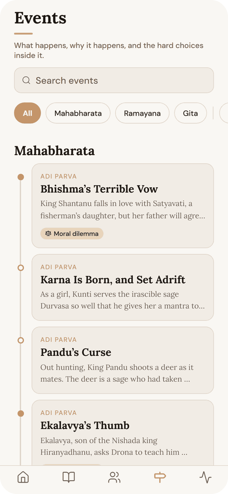</picture><br><b>Events</b><br><sub>A timeline through all three texts</sub></td>
</tr>
<tr>
<td align="center" valign="top" width="33%"><picture><source media="(prefers-color-scheme: dark)" srcset="docs/readme/screens/event-dark.png">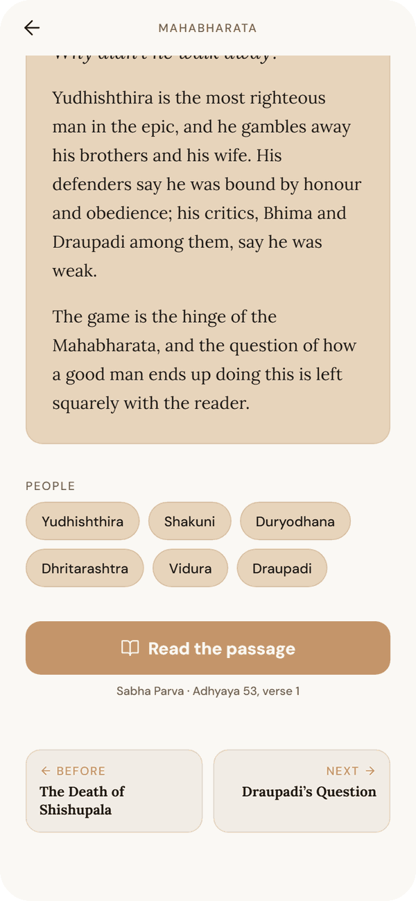</picture><br><b>Why it happens</b><br><sub>The cause, the dilemma, the people — and the passage</sub></td>
<td align="center" valign="top" width="33%"><picture><source media="(prefers-color-scheme: dark)" srcset="docs/readme/screens/home-dark.png">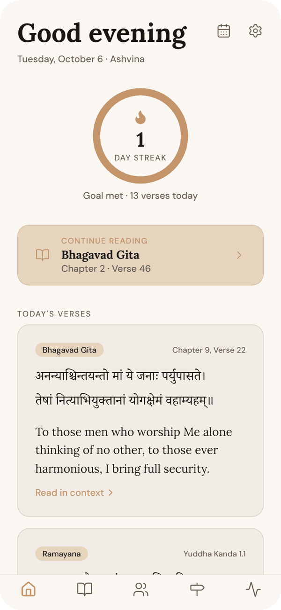</picture><br><b>Every day</b><br><sub>A verse from each text, and one story from the epics</sub></td>
<td align="center" valign="top" width="33%">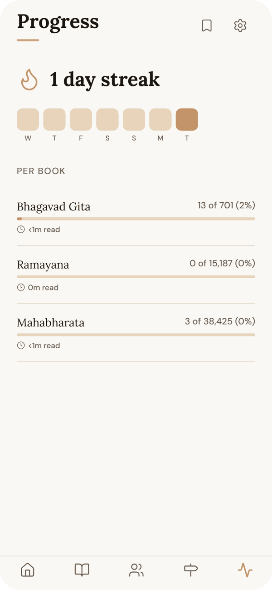<br><b>Your practice</b><br><sub>Streaks, a daily goal, and time spent in each book</sub></td>
</tr>
</table>

> **⚖ Draupadi’s Question — Was she lawfully lost?**
>
> No one gives a clear answer, and that silence is the scene’s real subject. Bhishma admits he cannot decide; Drona and Kripa say nothing; Vidura protests in vain. The epic shows a hall full of the wisest men of the age failing the woman in front of them because the rules seemed to point both ways — and suggests that when law and conscience part, silence is itself a choice.

<details>
<summary><b>All 54 characters</b></summary>

<br>

- *Mahabharata — Krishna and the storytellers:* **Krishna** <sub>कृष्ण</sub> · **Vyasa** <sub>व्यास</sub> · **Sanjaya** <sub>संजय</sub>
- *Mahabharata — The Pandavas:* **Yudhishthira** <sub>युधिष्ठिर</sub> · **Bhima** <sub>भीम</sub> · **Arjuna** <sub>अर्जुन</sub> · **Nakula** <sub>नकुल</sub> · **Sahadeva** <sub>सहदेव</sub> · **Draupadi** <sub>द्रौपदी</sub> · **Abhimanyu** <sub>अभिमन्यु</sub>
- *Mahabharata — The Kaurava side:* **Duryodhana** <sub>दुर्योधन</sub> · **Karna** <sub>कर्ण</sub> · **Dushasana** <sub>दुःशासन</sub> · **Shakuni** <sub>शकुनि</sub> · **Vikarna** <sub>विकर्ण</sub> · **Ashvatthama** <sub>अश्वत्थामा</sub>
- *Mahabharata — Elders and teachers:* **Bhishma** <sub>भीष्म</sub> · **Satyavati** <sub>सत्यवती</sub> · **Dhritarashtra** <sub>धृतराष्ट्र</sub> · **Gandhari** <sub>गान्धारी</sub> · **Pandu** <sub>पाण्डु</sub> · **Kunti** <sub>कुन्ती</sub> · **Vidura** <sub>विदुर</sub> · **Drona** <sub>द्रोण</sub>
- *Mahabharata — Allies, rivals and others:* **Shikhandi** <sub>शिखण्डी</sub> · **Ekalavya** <sub>एकलव्य</sub> · **Shishupala** <sub>शिशुपाल</sub>
- *Ramayana — Ayodhya:* **Rama** <sub>राम</sub> · **Sita** <sub>सीता</sub> · **Lakshmana** <sub>लक्ष्मण</sub> · **Bharata** <sub>भरत</sub> · **Shatrughna** <sub>शत्रुघ्न</sub> · **Dasharatha** <sub>दशरथ</sub> · **Kausalya** <sub>कौसल्या</sub> · **Kaikeyi** <sub>कैकेयी</sub> · **Manthara** <sub>मन्थरा</sub> · **Lava and Kusha** <sub>लव · कुश</sub>
- *Ramayana — Sages and the forest:* **Valmiki** <sub>वाल्मीकि</sub> · **Vishvamitra** <sub>विश्वामित्र</sub> · **Ahalya** <sub>अहल्या</sub> · **Shabari** <sub>शबरी</sub> · **Jatayu** <sub>जटायु</sub>
- *Ramayana — Kishkindha:* **Hanuman** <sub>हनुमान्</sub> · **Sugriva** <sub>सुग्रीव</sub> · **Vali** <sub>वाली</sub> · **Angada** <sub>अङ्गद</sub> · **Jambavan** <sub>जाम्बवान्</sub>
- *Ramayana — Lanka:* **Ravana** <sub>रावण</sub> · **Vibhishana** <sub>विभीषण</sub> · **Kumbhakarna** <sub>कुम्भकर्ण</sub> · **Indrajit** <sub>इन्द्रजित्</sub> · **Mandodari** <sub>मन्दोदरी</sub> · **Shurpanakha** <sub>शूर्पणखा</sub> · **Maricha** <sub>मारीच</sub>

</details>

<details>
<summary><b>All 58 events</b> &nbsp;<sub>⚖ = moral dilemma</sub></summary>

<br>

**Mahabharata**

1. **Bhishma’s Terrible Vow** ⚖ <sub>Adi Parva</sub>
2. **Karna Is Born, and Set Adrift** <sub>Adi Parva</sub>
3. **Pandu’s Curse** <sub>Adi Parva</sub>
4. **Ekalavya’s Thumb** ⚖ <sub>Adi Parva</sub>
5. **Karna at the Tournament** ⚖ <sub>Adi Parva</sub>
6. **The House of Lac** ⚖ <sub>Adi Parva</sub>
7. **Draupadi’s Svayamvara** ⚖ <sub>Adi Parva</sub>
8. **The Burning of the Khandava Forest** ⚖ <sub>Adi Parva</sub>
9. **The Death of Shishupala** <sub>Sabha Parva</sub>
10. **The Game of Dice** ⚖ <sub>Sabha Parva</sub>
11. **Draupadi’s Question** ⚖ <sub>Sabha Parva</sub>
12. **Exile: the Second Game** <sub>Sabha Parva</sub>
13. **Draupadi Questions Dharma** ⚖ <sub>Vana Parva</sub>
14. **Karna Gives Away His Armour** ⚖ <sub>Vana Parva</sub>
15. **The Yaksha’s Questions** ⚖ <sub>Vana Parva</sub>
16. **The Year in Disguise** <sub>Virata Parva</sub> <sub>(summary — not yet in the text)</sub>
17. **Arjuna Chooses Krishna** <sub>Udyoga Parva</sub>
18. **Krishna’s Mission of Peace** ⚖ <sub>Udyoga Parva</sub>
19. **Karna Learns Who He Is** ⚖ <sub>Udyoga Parva</sub>
20. **Kunti’s Plea** ⚖ <sub>Udyoga Parva</sub>
21. **Amba’s Vengeance** ⚖ <sub>Udyoga Parva</sub>
22. **The Song on the Battlefield** <sub>Bhishma Parva</sub>
23. **The Fall of Bhishma** ⚖ <sub>Bhishma Parva</sub>
24. **Abhimanyu in the Wheel** ⚖ <sub>Drona Parva</sub> <sub>(summary — not yet in the text)</sub>
25. **“Ashvatthama Is Dead”** ⚖ <sub>Drona Parva</sub> <sub>(summary — not yet in the text)</sub>
26. **Karna’s Chariot Wheel** ⚖ <sub>Karna Parva</sub> <sub>(summary — not yet in the text)</sub>
27. **Duryodhana’s Fall** ⚖ <sub>Shalya Parva</sub> <sub>(summary — not yet in the text)</sub>
28. **The Night Raid** ⚖ <sub>Sauptika Parva</sub> <sub>(summary — not yet in the text)</sub>
29. **Yudhishthira’s Grief, Bhishma’s Teaching** ⚖ <sub>Shanti Parva</sub>

**Ramayana**

1. **The Grief That Became Verse** <sub>Bala Kanda</sub>
2. **Rama Kills Tataka** ⚖ <sub>Bala Kanda</sub>
3. **Breaking Shiva’s Bow** <sub>Bala Kanda</sub>
4. **Kaikeyi’s Two Boons** ⚖ <sub>Ayodhya Kanda</sub>
5. **Rama Accepts Exile** ⚖ <sub>Ayodhya Kanda</sub>
6. **Dasharatha’s Death and the Old Curse** <sub>Ayodhya Kanda</sub>
7. **Bharata Refuses the Throne** ⚖ <sub>Ayodhya Kanda</sub>
8. **Shurpanakha** ⚖ <sub>Aranya Kanda</sub>
9. **The Golden Deer** ⚖ <sub>Aranya Kanda</sub>
10. **The Abduction of Sita** <sub>Aranya Kanda</sub>
11. **Shabari’s Welcome** <sub>Aranya Kanda</sub>
12. **The Killing of Vali** ⚖ <sub>Kishkindha Kanda</sub>
13. **Hanuman’s Leap** <sub>Sundara Kanda</sub>
14. **Hanuman Finds Sita** <sub>Sundara Kanda</sub>
15. **Lanka Burns** <sub>Sundara Kanda</sub>
16. **Vibhishana Seeks Refuge** ⚖ <sub>Yuddha Kanda</sub>
17. **The Bridge to Lanka** <sub>Yuddha Kanda</sub>
18. **Kumbhakarna Wakes** ⚖ <sub>Yuddha Kanda</sub>
19. **The Mountain of Herbs** <sub>Yuddha Kanda</sub>
20. **The Fall of Ravana** <sub>Yuddha Kanda</sub>
21. **Sita’s Ordeal by Fire** ⚖ <sub>Yuddha Kanda</sub>
22. **Sita Is Sent Away** ⚖ <sub>Uttara Kanda</sub>
23. **Shambuka** ⚖ <sub>Uttara Kanda</sub>
24. **Sita Returns to the Earth** ⚖ <sub>Uttara Kanda</sub>
25. **Rama Banishes Lakshmana** ⚖ <sub>Uttara Kanda</sub>

**Bhagavad Gita**

1. **Arjuna Lays Down His Bow** ⚖ <sub>Chapter 1</sub>
2. **The Teaching Begins** <sub>Chapter 2</sub>
3. **The Cosmic Form** ⚖ <sub>Chapter 11</sub>
4. **The Last Word** <sub>Chapter 18</sub>

</details>

The guides are commentary written for Katha, not scripture, in an explanatory rather than devotional voice. They follow the
critical editions and say so where popular retellings differ — Lakshmana's protective line, Shabari tasting the berries and
Ahalya turned to stone are all later additions, and Katha tells you so.

<p align="center"></p>

## 📚 The three texts

<table>
<tr>
<th></th><th>Bhagavad Gita</th><th>Ramayana</th><th>Mahabharata</th>
</tr>
<tr>
<td><b>Shape</b></td>
<td>18 chapters</td>
<td>7 kandas · 605 sargas</td>
<td>6 core parvas · 1,261 adhyayas</td>
</tr>
<tr>
<td><b>Verses</b></td>
<td>701</td>
<td>15,187</td>
<td>38,425</td>
</tr>
<tr>
<td><b>English</b></td>
<td>Annie Besant, 1922</td>
<td>M. N. Dutt, 1891–94</td>
<td>M. N. Dutt, 1895–1905</td>
</tr>
<tr>
<td><b>Extras</b></td>
<td>An explanation for every verse</td>
<td>Story notes, characters, events</td>
<td>Story notes, characters, events</td>
</tr>
</table>

<details>
<summary><b>Bhagavad Gita — the 18 chapters</b></summary>

<br>

1. Arjuna Vishada Yoga · 2. Sankhya Yoga · 3. Karma Yoga · 4. Jnana Karma Sannyasa Yoga · 5. Karma Sannyasa Yoga · 6. Dhyana Yoga · 7. Jnana Vijnana Yoga · 8. Akshara Brahma Yoga · 9. Raja Vidya Raja Guhya Yoga · 10. Vibhuti Yoga · 11. Vishvarupa Darshana Yoga · 12. Bhakti Yoga · 13. Kshetra Kshetrajna Vibhaga Yoga · 14. Gunatraya Vibhaga Yoga · 15. Purushottama Yoga · 16. Daivasura Sampad Vibhaga Yoga · 17. Shraddhatraya Vibhaga Yoga · 18. Moksha Sannyasa Yoga

</details>

<details>
<summary><b>Ramayana — the 7 kandas</b></summary>

<br>

| | Kanda | Sargas | Verses |
|---:|---|---:|---:|
| 1 | Bala Kanda | 76 | 1,553 |
| 2 | Ayodhya Kanda | 111 | 2,722 |
| 3 | Aranya Kanda | 71 | 1,639 |
| 4 | Kishkindha Kanda | 66 | 1,598 |
| 5 | Sundara Kanda | 66 | 1,990 |
| 6 | Yuddha Kanda | 115 | 3,677 |
| 7 | Uttara Kanda | 100 | 2,008 |

</details>

<details>
<summary><b>Mahabharata — the 6 core parvas</b></summary>

<br>

| | Parva | Adhyayas | Verses |
|---:|---|---:|---:|
| 1 | Adi Parva | 225 | 6,006 |
| 2 | Sabha Parva | 72 | 2,054 |
| 3 | Vana Parva | 299 | 8,765 |
| 4 | Udyoga Parva | 195 | 5,627 |
| 5 | Bhishma Parva | 117 | 4,503 |
| 6 | Shanti Parva | 353 | 11,470 |

</details>

<p align="center"></p>

## 🎨 Five themes

<picture><source media="(prefers-color-scheme: dark)" srcset="docs/readme/themes-dark.svg"></picture>

Lotus for mornings, Ashram for lamplight, Night Puja for late reading, Saffron for festival days, Minimalist for nothing but the
words. Text size, theme and language are all in Settings, and everything changes in place — you never lose your spot.

<p align="center"></p>

## 🔍 Every word sourced

Nothing in Katha's scripture is machine-translated, paraphrased or filled in. Each verse pairs a public-domain Sanskrit e-text
with a public-domain English translation, matched verse by verse — and where a match couldn't be verified, the verse was left
out rather than guessed.

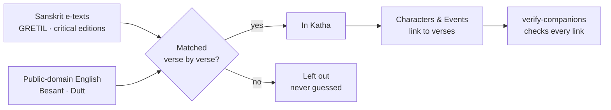

| Text | Coverage of the source | |
|---|---|---|
| Bhagavad Gita | `▰▰▰▰▰▰▰▰▰▰` | all 18 chapters, every verse |
| Ramayana | `▰▰▰▰▰▰▰▰▱▱` | 81% of the critical edition's 18,761 verses, all 7 kandas |
| Mahabharata | `▰▰▰▰▰▰▰▰▰▱` | 86.9% of the six core parvas |

The full audit trail is in [`CONTENT_STATUS.md`](CONTENT_STATUS.md), [`FILL_SUMMARY.md`](FILL_SUMMARY.md) and
[`VERIFICATION_LOG.md`](VERIFICATION_LOG.md).

<p align="center"></p>

## ▶ Run it

You need [Node.js](https://nodejs.org) 20 or newer.

```bash
git clone https://github.com/radhepa/Katha.git
cd Katha
npm install
npx expo start
```

Press **w** to open it in your browser, or scan the QR code with **Expo Go** on your phone (iOS or Android).

<details>
<summary><b>Useful scripts</b></summary>

<br>

| Command | What it does |
|---|---|
| `npm run web` | Start straight in the browser |
| `node scripts/verify-companions.mjs` | Check every Characters & Events link, cross-reference and Sanskrit name against the text |
| `node scripts/build-index.mjs` | Rebuild the small index Home and Library read (run after changing a book file) |

</details>

<details>
<summary><b>How it's built</b></summary>

<br>

- **Expo (SDK 56) + React Native**, written in strict TypeScript — one codebase for iOS, Android and the web
- **SQLite** on the device for progress, bookmarks and streaks; scripture ships as static JSON, so it works fully offline
- **Zustand** for app state, **React Navigation** for tabs and pages
- Type set in **Lora**, **DM Sans**, **Noto Serif Devanagari** and **Noto Serif**

```
assets/data/        the three texts, characters.json, events.json, the generated index
scripts/            text assembly, cross-checking and verification
src/screens/        Home, Library, Reader, Characters, Events, Progress, Settings …
src/components/     verse block, explain drawer, chapter picker, shared UI
src/lib/            data access, search, characters & events
src/db/             SQLite: progress, bookmarks, streaks, reading time
```

</details>

<p align="center"></p>

## 🪔 What's next

- [x] All 701 verses of the Gita, each with an explanation
- [x] The full Ramayana — all seven kandas
- [x] The six core parvas of the Mahabharata
- [x] Characters & Events, linked into the text
- [ ] Hindi, Gujarati and Tamil translations, human-reviewed
- [ ] Explanations for the Ramayana and Mahabharata
- [ ] The remaining parvas of the Mahabharata
- [ ] Festival dates checked against a panchang for every year

<p align="center"></p>

## 🙏 Credits

- **Translations** — Annie Besant, *The Bhagavad-Gîtâ (The Lord's Song)*, 4th ed. 1922; Manmatha Nath Dutt's Ramayana (1891–94) and Mahabharata (1895–1905). All public domain.
- **Sanskrit** — GRETIL; the critical-edition e-texts of the Ramayana and Mahabharata (M. Tokunaga, rev. J. Smith); verse alignment with the Itihāsa corpus (Aralikatte et al., 2021).
- **Type & icons** — Lora, DM Sans, Noto Serif and Noto Serif Devanagari (SIL Open Font License); Lucide icons.

The scripture texts and translations are in the public domain. For the code, see [LICENSE](LICENSE).

<br>

<div align="center">


<sub>Made by **Radhe** · <i>Even five minutes a day adds up.</i></sub>

</div>
